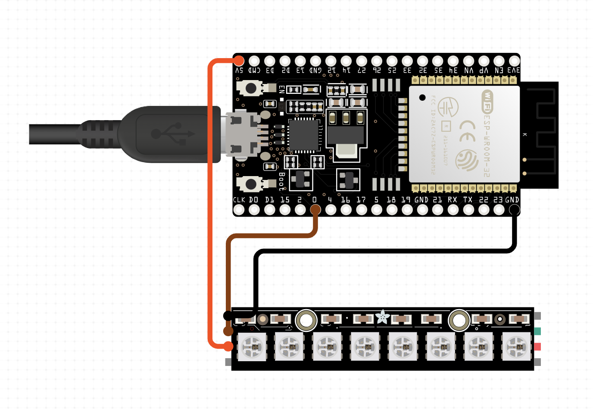

# Edrans On-Air Display

v1 by Jacob Verhoeks <jjverhoeks .. at .. edrans.com>

This is the arduino code for the on-air sign, described in the Edrans Blog post.
In short, with a small script on the Mac it published an MQTT message. This device subscribes on the
topic and turns on or off.

The script can be found [here](./watch-camera.sh). It needs an mqtt server, i use my raspberry-pi with home-assistant and mosquito mqtt.

Check this page for some pictures an a small demo gif: [Demo](./DEMO.md)

## Description

Arduino code for an ESP32 that lights a Led strip when a message is received by MQTTClient

1. Connect to Wifi
2. Connect to MQTT Broker server
3. Subscribe to a MQTT topic
4. Loop until message is received
   a  if message is `{ "onair": 1 }` then turn led on
   b. if message is `{ "onair": 0 }` turn the led off

## Hardware

This code can work with any esp32 with a ws2812b compatible led strips like the Adafruit Neopixel series.

Example design can be made on the excellent website <circuito.io>

<https://www.circuito.io/app?components=513,216577,360217>

## Usage

* Install the Arduino Software
* Install the ESP32 board software
* Install the required libraries
* Rename the iot.h.templ to iot.h and fill in the required fields
* Change the PIN id for the LED controller.
* Run compile and upload to the esp32

### Required Arduino Libraries

| Library           | Author          | Reference                                       |
| ----------------- | --------------- | ----------------------------------------------- |
| MQTT              | Joel Gaelwiler  | <https://github.com/256dpi/arduino-mqtt>        |
| ArduinoJson       | Benoit Blanchon | <https://arduinojson.org/>                      |
| Adafruit_NeoPixel | Adafruit        | <https://github.com/adafruit/Adafruit_NeoPixel> |
